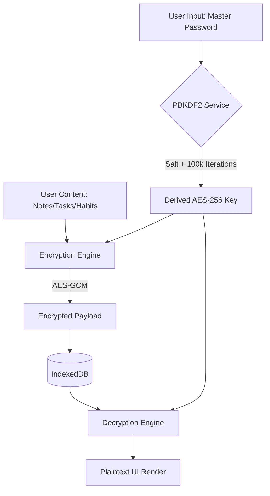

# 🏛️ System Overview & Architecture

Vault Tracker is designed as a **Single Page Application (SPA)** with an embedded cryptographic engine. It follows a decentralized, client-side-only architecture to ensure absolute data sovereignty.

## 🛠️ How it Works (Flowchart)

## 🔐 Security Principles

1. **Self-Sovereignty**: The user is the only one who holds the key. If the master password is lost, the data is cryptographically unrecoverable.
2. **Zero-Knowledge**: The application logic (Vite/React) has no visibility into the plaintext data until the vault is explicitly unlocked in memory.
3. **Nonce-Based Isolation**: Every encryption operation uses a unique initialization vector (Nonce) to prevent pattern analysis.

## 📦 Data Structure

All data is stored as a "Container" item in IndexedDB. Each container consists of:
- `id`: A random UUID.
- `type`: 'note', 'task', 'habit', or 'analytics'.
- `payload`: The AES-256-GCM encrypted ciphertext.
- `nonce`: The IV required for decryption.
- `metadata`: Public-facing tags or priority markers for indexing (optional, based on privacy settings).

## 📊 Lifecycle Flow

1. **Initialization**: The `VaultProvider` checks for existing vaults in IndexedDB.
2. **Unlocking**: The user provides a password; the app derives a temporary `CryptoKey` stored only in React state.
3. **Hydration**: The `useItems` hook fetches encrypted blobs, decrypts them in parallel, and renders the UI.
4. **Auto-Lock**: On page refresh or session timeout, the `CryptoKey` is cleared from memory.
