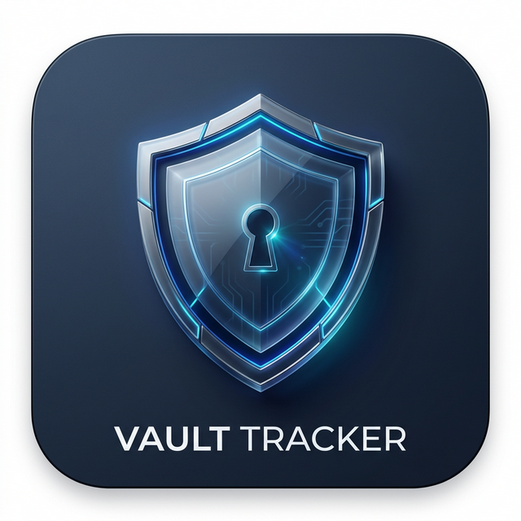

# 🛡️ Vault Tracker v1.1.0

**Zero-Trust. Zero-Knowledge. 100% Private.**

Vault Tracker is a premium, decentralized productivity suite designed for users who refuse to compromise on privacy. Built with a "Security-First" philosophy, it transforms your browser into a high-performance encryption engine where your notes, tasks, and habits are sealed with military-grade AES-256-GCM.

### 🌐 The Vault Ecosystem
Experience the full suite or use focused mini-apps for specific workflows:
- **[Vault Tracker](https://nrupala.github.io/vault-tracker/)** (Parent App)
- **[Vault Tasks](https://nrupala.github.io/vault-tasks/)** (Tasks & Calendar)
- **[Vault Notes](https://nrupala.github.io/vault-notes/)** (Notes & Research)
- **[Vault Habits](https://nrupala.github.io/vault-habits/)** (Habits & Streaks)
- **[Vault Ledger](https://nrupala.github.io/vault-ledger/)** (Finance & Budget)

## ✨ New in v1.1.0
- **📱 Mobile Maturity**: High-fidelity PWA support with `viewport-fit=cover` for iOS/Android notch support and standalone native builds.
- **🔄 Universal Data Import**: Seamlessly import data from **JSON**, **Plain Text**, and **iCalendar (.ics)** formats directly into your encrypted vaults.
- **🔢 Version Tracking**: Official versioning now visible in-app (v1.1.0).

## 🔒 The Zero-Trust Model
Vault Tracker operates on a **Local-Only** data persistence model:
1. **No Backend**: Your data never touches a server.
2. **PBKDF2 Derivation**: Your master password is used to derive a local encryption key (100,000 iterations).
3. **AES-GCM Encryption**: All content is encrypted *before* it hits the storage layer.
4. **Decentralized Storage**: Data is saved in your browser's IndexedDB, accessible only through your master key.

## 🛠️ Tech Stack
- **Frontend**: React 19, TypeScript, Vite
- **Styling**: Vanilla CSS, Framer Motion (Animations)
- **Engine**: Web Crypto API, Dexie.js (IndexedDB)
- **Tooling**: Capacitor (Mobile), Vitest (Tests)

---
Copyright © 2026 Nrupal Akolkar. Licensed under MIT.

