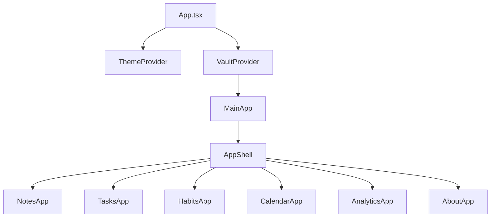
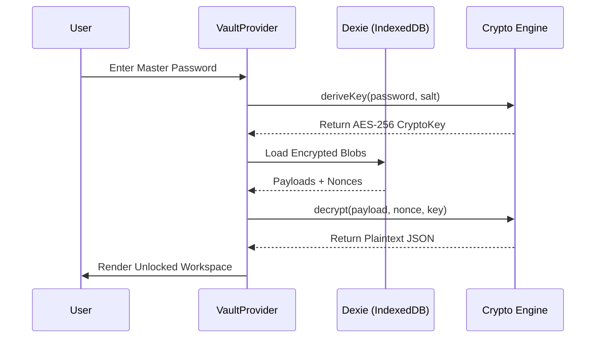

# 🏗️ Code Visualization & Analysis

## Component Hierarchy Map

The application follows a container-based modular structure.

## Data Life Cycle (Sequence Diagram)

## Module Responsibilities

| Module | Responsibility |
| :--- | :--- |
| `useVault` | Manages Master Password, Key Derivation, and Vault Metadata. |
| `useItems` | Core CRUD operations. Handles encryption *before* writing to DB. |
| `AppShell` | Responsive layout wrapper with Sidebar/BottomNav logic. |
| `ContainerItem` | Generic UI wrapper for all vault items (Notes/Tasks/Habits). |
| `crypto.ts` | Stateless wrapper for the Web Crypto API. |
| `db.ts` | Dexie.js schema definition and database initialization. |
